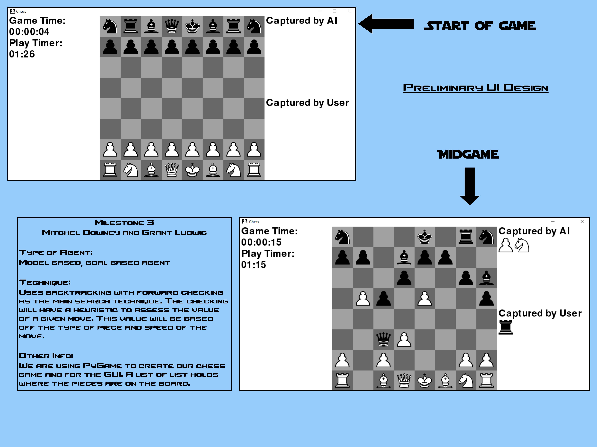

## Mitchel Downey: downeym1@seattleu.edu
## Grant Ludwig: ludwigg@seattleu.edu

### Description of Goals
#### Milestone 3
By milestone 3 we must have a preliminary design of our system which includes what AI technique we are using and a simple user interface. For this milestone we should have a 30 X 40 poster of our design.
#### Milestone 4
This milestone is the final due date. We should have our complete chess AI working and facing human opponents. We need to create a 2 minute demo video of the AI working.
#### AI Goals
The chess AI we create should be able to:
- Play chess
- Challenge the human opponent
- Potentially beat a human opponent

### Project Drawing

### Milestone 3 Poster

### Found Information
Easy guide to building a simple chess AI: [Link](https://medium.freecodecamp.org/simple-chess-ai-step-by-step-1d55a9266977)

### Milestone 4 Poster
#### README
To run the game type:

py main.py [number of moves AI looks ahead, 0-infinity]

Example:

py main.py 2

We recommend setting the number of moves to look ahead between 1 and 2. 1 and 2 won't take long and if you are aren't a great chess player, it will act normal. If you set the value higher, the AI will assume you are actually a good player, and if you aren't the AI might actually be easier.

When checked, you will only be able to make moves to make you unchecked. However if the move moves into the potential attack from another piece, it will allow it which should cause you piece to be taken. Currently, when checkmated the king still must be taken. When a pawn reaches the end of the board, it will automatically become a queen.

Our algorithm using alpha beta pruning with the white pieces (user) maximizing and the black pieces (AI) minimizing. The algorithm will also prune moves that have been looked through in other iterations to improve performance. The algorithm/AI will still make moves that could be considered mistakes.

### Demo
Demo Link: [Youtube](https://youtu.be/3qLtjBizD-M)
