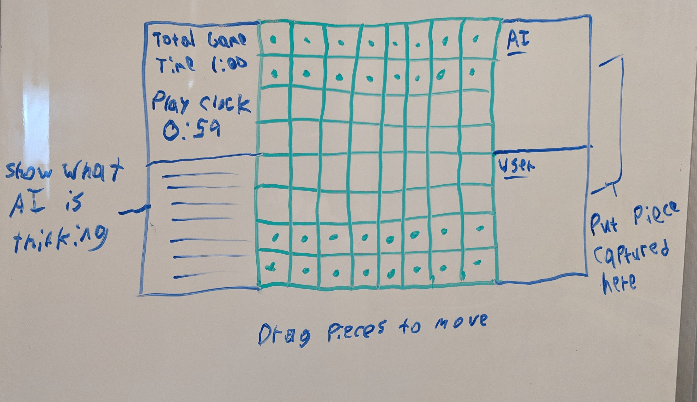

## Mitchel Downey: downeym1@seattleu.edu
## Grant Ludwig: ludwigg@seattleu.edu

### Description of Goals
#### Milestone 3
By milestone 3 we must have a preliminary design of our system which includes what AI technique we are using and a simple user interface. For this milestone we should have a 30 X 40 poster of our design.
#### Milestone 4
This milestone is the final due date. We should have our complete chess AI working and facing human opponents. We need to create a 2 minute demo video of the AI working.
#### AI Goals
The chess AI we create should be able to:
- Play chess
- Challenge the human opponent
- Potentially beat a human opponent

### Project Drawing

### Found Information
Easy guide to building a simple chess AI: [Link](https://medium.freecodecamp.org/simple-chess-ai-step-by-step-1d55a9266977)
